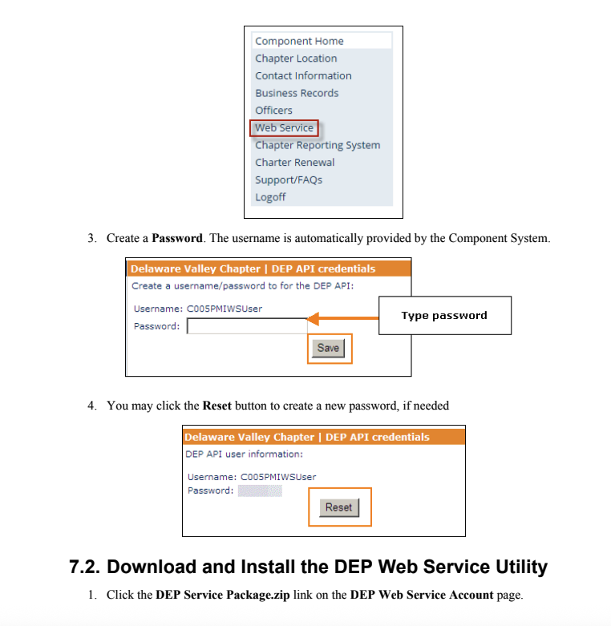

# PMI Members API – NestJS Wrapper

A robust, cross-platform REST API gateway for Project Management Institute (PMI) Chapter Membership data, built with [NestJS](https://nestjs.com/). This project wraps PMI's legacy SOAP-based DEP (Data Extraction Platform) Web Service, providing a modern, developer-friendly JSON API for secure and automated access to chapter member data.

---

## Table of Contents
- [Features](#features)
- [Architecture](#architecture)
- [API Endpoints](#api-endpoints)
- [Authentication](#authentication)
- [Environment Setup](#environment-setup)
- [WSDL File Management](#wsdl-file-management)
- [Running & Building](#running--building)
- [Testing](#testing)
- [Error Handling](#error-handling)
- [Troubleshooting](#troubleshooting)
- [Contributing](#contributing)
- [License](#license)

---

## Features
- **RESTful API**: Modern endpoints for membership data.
- **SOAP Integration**: Seamlessly communicates with PMI's DEP SOAP API.
- **WS-Security Authentication**: Secure credentials with WSSE headers.
- **CSV to JSON Parsing**: Converts PMI's CSV payloads to JSON.
- **Cross-Platform**: Works on Mac, Windows, and Linux.
- **Extensive Logging**: Logs raw SOAP responses for debugging (sanitize in production).
- **Error Handling**: Consistent, informative error responses.

---

## Architecture
- **NestJS v10+**: Modular, scalable Node.js framework.
- **Axios & soap**: For HTTP and SOAP communication.
- **csv-parse**: For parsing CSV member data.
- **dotenv**: For environment configuration.
- **Modules**:
  - `DepModule`: PMI integration root.
  - `DepService`: Handles SOAP logic.
  - `DepController`: Exposes REST endpoints.
  - `SoapClientUtil`: SOAP/WSDL utility.

---

## API Endpoints

### 1. Get Full Member Extract
**GET** `/members/extract`
- Returns the latest full member extract for the chapter.
- **SOAP Method**: `GetMemberExtractReport`
- **Response Example:**
```json
{
  "success": true,
  "message": "",
  "dataDate": "2024-11-01T00:00:00Z",
  "memberCount": 218,
  "members": [
    {
      "PMI_ID": "1234567",
      "FirstName": "Jane",
      "LastName": "Doe",
      "Email": "jane.doe@example.com"
      // ...
    }
  ],
  "rawSoapResponse": "<s:Envelope>...</s:Envelope>"
}
```

### 2. Get Last Run Metadata
**GET** `/members/last-run`
- Returns metadata of the last member data update.
- **SOAP Method**: `GetMemberExtractReportLastRun`
- **Response Example:**
```json
{
  "success": true,
  "message": "",
  "dataDate": "2024-11-01T00:00:00Z",
  "memberCount": 218,
  "rawSoapResponse": "<s:Envelope>...</s:Envelope>"
}
```

---

## Authentication
- **WS-Security** (WSSE) using PMI service account credentials.
- Credentials are loaded from environment variables:
  - `PMI_DEP_USERNAME`
  - `PMI_DEP_PASSWORD`
- **Never commit credentials to source control!**

---

## Environment Setup
1. **Clone the repository:**
   ```bash
   git clone <repo-url>
   cd pmi-members-api
   ```
2. **Install dependencies:**
   ```bash
   npm install
   ```
3. **Configure environment:**
   - Copy `.env.example` to `.env` and fill in credentials:
     ```env
     PMI_DEP_USERNAME=your_username
     PMI_DEP_PASSWORD=your_password
     ```

---

## Obtaining Your PMI DEP Username and Password

To use this API, you need valid PMI DEP credentials. These are typically provided to chapter administrators via the PMI Chapter Portal or by PMI support.

1. Log in to the [PMI Chapter Portal](https://components.pmi.org) with your chapter admin account.
2. Navigate to the **DEP (Data Extraction Platform)** section or request credentials from your chapter's PMI liaison/support.
3. The username and password will be displayed as shown below:

<p align="center">
  
</p>

If you do not see the credentials, contact your chapter support or PMI directly for access.

---

## WSDL File Management
- **Manual Step:** Copy the required `DEPService.wsdl` (and any related `.xsd` files) from `src/dep/wsdl/` to `dist/dep/wsdl/` after building.
- This is required because NestJS build clears the `dist` folder.
- Example:
  ```bash
  cp -R src/dep/wsdl dist/dep/wsdl
  ```
- **Note:** This step is manual by design for maximum transparency and control.

---

## Running & Building
- **Development:**
  ```bash
  npm run start:dev
  ```
- **Production:**
  ```bash
  npm run build
  cp -R src/dep/wsdl dist/dep/wsdl
  npm run start:prod
  ```
- **Standard Start:**
  ```bash
  npm run start
  ```

---

## Testing
- **Unit Tests:**
  ```bash
  npm run test
  ```
- **End-to-End Tests:**
  ```bash
  npm run test:e2e
  ```
- **Coverage:**
  ```bash
  npm run test:cov
  ```
- **Mocking:** SOAP responses are mocked for unit tests. See `test/` folder.

---

## Error Handling
- All API responses follow this format on error:
  ```json
  {
    "success": false,
    "message": "Authentication failed",
    "errorCode": "AUTH_401"
  }
  ```
- Handles:
  - SOAP connection issues
  - WSDL unavailability
  - Invalid credentials
  - Data parsing errors
- Errors are logged with context for support.

---

## Troubleshooting
- **WSDL Not Found:** Ensure manual copy to `dist/dep/wsdl` after build.
- **Invalid Credentials:** Double-check `.env` values.
- **SOAP Errors:** See logs for raw SOAP responses.
- **International Characters:** CSV parsing handles UTF-8; file encodings are normalized.
- **Production Logs:** Sanitize logs to avoid leaking PII.

---

## Contributing
1. Fork and clone the repo.
2. Create a feature branch.
3. Commit changes with clear messages.
4. Open a Pull Request.

---

## Stay in touch

Author – [Sina Ghazi](https://www.upwork.com/freelancers/sinaghazi).

## License

2025 by Innovategy Oy is licensed under [CC BY 4.0](https://creativecommons.org/licenses/by/4.0/)

## Support

For support, please open an issue in the GitHub repository or contact the development team.
